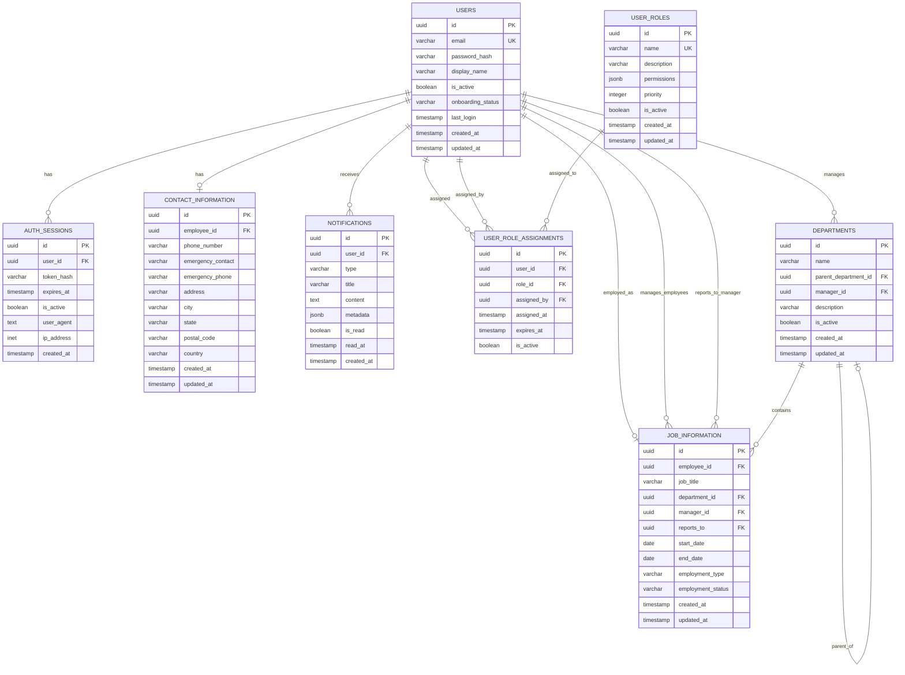

# SvelteHR Database Schema & Relationships

## Entity Relationship Diagram

## Table Relationships Summary

### 1. **USERS** (Central Entity)
The core table that represents all system users (employees, managers, HR staff, admins).

**Relationships:**
- **One-to-Many** with `AUTH_SESSIONS` - Users can have multiple login sessions
- **One-to-One** with `CONTACT_INFORMATION` - Each user has one contact record
- **One-to-One** with `JOB_INFORMATION` (as employee) - Each user has one job record
- **One-to-Many** with `JOB_INFORMATION` (as manager) - Managers supervise multiple employees
- **One-to-Many** with `JOB_INFORMATION` (as reports_to) - Senior staff receive reports from multiple employees
- **One-to-Many** with `DEPARTMENTS` (as manager) - Users can manage multiple departments
- **One-to-Many** with `NOTIFICATIONS` - Users receive multiple notifications
- **One-to-Many** with `USER_ROLE_ASSIGNMENTS` (as user) - Users can have multiple roles
- **One-to-Many** with `USER_ROLE_ASSIGNMENTS` (as assigned_by) - Users assign roles to others

### 2. **AUTH_SESSIONS**
Manages user authentication sessions and tokens.

**Relationships:**
- **Many-to-One** with `USERS` - Multiple sessions belong to one user

### 3. **CONTACT_INFORMATION**
Stores employee contact and emergency information.

**Relationships:**
- **One-to-One** with `USERS` - Each contact record belongs to one employee

### 4. **DEPARTMENTS**
Organizational structure with hierarchical department management.

**Relationships:**
- **Self-Referential** - Departments can have parent departments (hierarchy)
- **Many-to-One** with `USERS` - Each department has one manager
- **One-to-Many** with `JOB_INFORMATION` - Departments contain multiple employees

### 5. **JOB_INFORMATION**
Employment details including position, department, and reporting structure.

**Relationships:**
- **Many-to-One** with `USERS` (employee_id) - Job info belongs to one employee
- **Many-to-One** with `USERS` (manager_id) - Each job has one direct manager
- **Many-to-One** with `USERS` (reports_to) - Reporting relationship
- **Many-to-One** with `DEPARTMENTS` - Each job belongs to one department

### 6. **USER_ROLES**
Defines available roles in the system (Admin, HR Admin, Manager, Employee).

**Relationships:**
- **One-to-Many** with `USER_ROLE_ASSIGNMENTS` - Roles can be assigned to multiple users

### 7. **USER_ROLE_ASSIGNMENTS**
Junction table managing role assignments with audit trail.

**Relationships:**
- **Many-to-One** with `USERS` (user_id) - Assignment belongs to one user
- **Many-to-One** with `USERS` (assigned_by) - Assignment made by one user
- **Many-to-One** with `USER_ROLES` - Assignment references one role

### 8. **NOTIFICATIONS**
System notifications and alerts for users.

**Relationships:**
- **Many-to-One** with `USERS` - Notifications belong to one user

## Key Design Patterns

### 1. **Audit Trail Pattern**
Most tables include `created_at` and `updated_at` timestamps for tracking changes.

### 2. **Soft Delete Pattern**
Tables use `is_active` flags instead of hard deletes to maintain data integrity and history.

### 3. **Role-Based Access Control (RBAC)**
- `USER_ROLES` defines permissions using JSONB
- `USER_ROLE_ASSIGNMENTS` tracks who assigned roles and when
- Priority field in roles determines hierarchy

### 4. **Hierarchical Organization**
- Departments support nested structure via `parent_department_id`
- Job information tracks both direct manager and reporting relationships

### 5. **Security Features**
- Password hashes stored, never plain text
- Session tokens with expiration
- IP address and user agent tracking for sessions

## Cardinality Details

| Relationship | Type | Description |
|-------------|------|-------------|
| Users → Auth Sessions | 1:N | One user can have many active sessions |
| Users → Contact Info | 1:1 | Each user has exactly one contact record |
| Users → Job Info (as employee) | 1:1 | Each employee has one current job |
| Users → Job Info (as manager) | 1:N | Managers supervise multiple employees |
| Users → Departments (as manager) | 1:N | Users can manage multiple departments |
| Users → Notifications | 1:N | Users receive multiple notifications |
| Users → Role Assignments | 1:N | Users can have multiple role assignments |
| Departments → Departments | 1:N | Hierarchical parent-child relationship |
| Departments → Job Info | 1:N | Departments contain multiple positions |
| User Roles → Role Assignments | 1:N | Roles assigned to multiple users |

## Indexes for Performance

All foreign key relationships have corresponding indexes for optimal query performance:
- `idx_auth_sessions_user_id`
- `idx_contact_information_employee_id`
- `idx_departments_manager_id`
- `idx_departments_parent_department_id`
- `idx_job_information_manager_id`
- `idx_job_information_reports_to`
- `idx_user_role_assignments_assigned_by`
- `idx_user_role_assignments_role_id`
- `idx_notifications_user_id`

## GraphQL API Implications

With PostGraphile, these relationships automatically generate:
- **Forward relations**: Navigate from parent to child (e.g., `user.jobInformation`)
- **Reverse relations**: Navigate from child to parent (e.g., `jobInformation.employee`)
- **Connection types**: Paginated lists for one-to-many relationships
- **Filtering**: Query by related entity fields
- **Mutations**: Create/update related entities in single operations