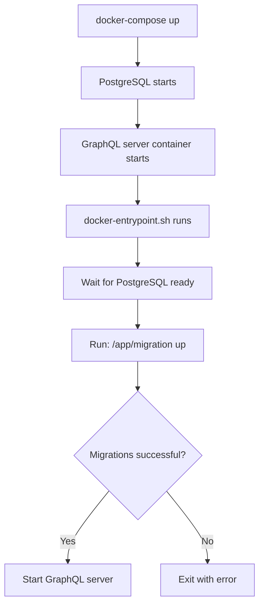

# Docker & Migration System Update Summary

## ✅ Completed Changes

### 1. SeaORM Rust Migrations Created

**Location**: `/graphql-rust-server/migration/`

Created 12 type-safe Rust migration modules replacing SQL files:
- ✅ `m20251017_001_schemas.rs` - Schema setup
- ✅ `m20251017_002_enums.rs` - PostgreSQL enums
- ✅ `m20251017_003_auth.rs` - Authentication & RBAC (7 tables)
- ✅ `m20251017_004_hr_core.rs` - HR core (3 tables)
- ✅ `m20251017_005_tasks.rs` - Task management (5 tables)
- ✅ `m20251017_006_events.rs` - Event system (5 tables)
- ✅ `m20251017_007_documents.rs` - Document management (6 tables)
- ✅ `m20251017_008_reviews.rs` - Performance reviews (5 tables)
- ✅ `m20251017_009_employee.rs` - Employee details (5 tables)
- ✅ `m20251017_010_time.rs` - Time tracking (2 tables)
- ✅ `m20251017_011_system.rs` - System tables (11 tables)

**Total**: 47+ tables with full up/down migration support

### 2. Dockerfile Updated

**File**: `Dockerfile`

**Changes**:
```diff
+ # Install postgresql-client for pg_isready
+ RUN apt-get install -y postgresql-client

+ # Copy migration binary
+ COPY --from=builder /app/target/release/migration /app/

+ # Copy and set up entrypoint script
+ COPY docker-entrypoint.sh /app/
+ RUN chmod +x /app/docker-entrypoint.sh

+ # Build both binaries
+ RUN cargo build --release --bin hr-graphql-server && \
+     cargo build --release --bin migration

+ # Use entrypoint for auto-migrations
+ ENTRYPOINT ["/app/docker-entrypoint.sh"]
```

### 3. Docker Entrypoint Script Created

**File**: `docker-entrypoint.sh` (NEW)

**Features**:
- ✅ Waits for PostgreSQL to be ready
- ✅ Runs SeaORM migrations automatically
- ✅ Provides clear logging with emojis
- ✅ Exits gracefully on migration failure
- ✅ Starts GraphQL server after successful migrations

**Startup Flow**:
```
1. 🚀 Starting SvelteHR GraphQL Rust Server...
2. ⏳ Waiting for PostgreSQL to be ready...
3. ✅ PostgreSQL is ready!
4. 📦 Running SeaORM database migrations...
5. ✅ Migrations completed successfully!
6. 🚀 Starting GraphQL server on 0.0.0.0:4000...
```

### 4. Docker Compose Updated

**File**: `docker-compose.yml`

**Changes**:
```diff
- # TODO: Update this path to point to your database init schema file
- # - /home/chanway/Projects/SvelteHR/database/init/001-complete-schema.sql:/docker-entrypoint-initdb.d/001-init.sql:ro
+ # Note: Database schema is managed by SeaORM Rust migrations
+ # Migrations run automatically when hr-graphql-rust container starts
+ # See: graphql-rust-server/migration/README.md
```

### 5. Documentation Created

**Files Created**:
1. ✅ `migration/README.md` - Migration module documentation
2. ✅ `MIGRATION_GUIDE.md` - Comprehensive migration guide
3. ✅ `MIGRATION_QUICK_START.md` - Quick reference card

## 🔧 How It Works

### Automatic Migration on Container Start



### Manual Migration Commands

```bash
# Local development
cargo run --bin migration status
cargo run --bin migration up
cargo run --bin migration down

# Inside Docker container
docker exec hr-graphql-rust /app/migration status
docker exec hr-graphql-rust /app/migration up
```

## 🎯 Benefits

| Feature | Before (SQL) | After (Rust) |
|---------|-------------|-------------|
| **Type Safety** | ❌ Runtime SQL errors | ✅ Compile-time validation |
| **Automation** | ❌ Manual script execution | ✅ Auto-runs on startup |
| **Rollback** | ❌ No rollback support | ✅ Built-in up/down migrations |
| **Consistency** | ⚠️ SQL files may drift | ✅ Matches SeaORM models |
| **Version Control** | ⚠️ Separate SQL files | ✅ Part of Rust codebase |
| **Cross-Platform** | ❌ Requires bash + psql | ✅ Pure Rust, works anywhere |

## 📦 Files Structure

```
graphql-rust-server/
├── Dockerfile                      # ✅ Updated to build migration binary
├── docker-compose.yml              # ✅ Updated comments
├── docker-entrypoint.sh            # 🆕 New migration runner
├── MIGRATION_GUIDE.md              # 🆕 Comprehensive guide
├── MIGRATION_QUICK_START.md        # 🆕 Quick reference
├── migration/
│   ├── lib.rs                      # 🆕 Migration registry
│   ├── main.rs                     # 🆕 CLI entry point
│   ├── m20251017_001_schemas.rs    # 🆕 Schema setup
│   ├── m20251017_002_enums.rs      # 🆕 Enums
│   ├── m20251017_003_auth.rs       # 🆕 Auth tables
│   ├── ...                         # 🆕 11 more modules
│   └── README.md                   # 🆕 Migration docs
└── scripts/
    └── init-db.sh                  # ❌ Deprecated (keep for reference)
```

## 🚀 Usage

### Development

```bash
# Start containers (migrations run automatically)
docker-compose up -d

# Watch logs to see migration progress
docker logs -f hr-graphql-rust
```

### Production

The same! Migrations run automatically on container startup.

### Manual Migration Control

```bash
# Check status
docker exec hr-graphql-rust /app/migration status

# Apply specific number of migrations
docker exec hr-graphql-rust /app/migration up -n 3

# Rollback
docker exec hr-graphql-rust /app/migration down
```

## ⚠️ Breaking Changes

### Deprecated Files

These files are no longer used:
- ❌ `/db/migrations/*.sql` - Replaced by Rust migrations
- ❌ `/scripts/init-db.sh` - Replaced by docker-entrypoint.sh

**Recommendation**: Archive these files:
```bash
mkdir -p db/migrations/_archive scripts/_archive
mv db/migrations/*.sql db/migrations/_archive/
mv scripts/init-db.sh scripts/_archive/
```

### Environment Variables

No changes needed! Same `DATABASE_URL` is used by both SQL and Rust migrations.

## 🧪 Testing the Changes

### 1. Fresh Database Start

```bash
# Stop everything
docker-compose down

# Remove PostgreSQL volume
docker volume rm sveltehr_postgres_data

# Recreate volume
docker volume create sveltehr_postgres_data

# Start containers (migrations run automatically)
docker-compose up -d

# Watch migration logs
docker logs -f hr-graphql-rust
```

Expected output:
```
🚀 Starting SvelteHR GraphQL Rust Server...
⏳ Waiting for PostgreSQL to be ready...
✅ PostgreSQL is ready!
📦 Running SeaORM database migrations...
Applying migration 'm20251017_001_schemas'
Applying migration 'm20251017_002_enums'
Applying migration 'm20251017_003_auth'
...
✅ Migrations completed successfully!
🚀 Starting GraphQL server on 0.0.0.0:4000...
```

### 2. Verify Schema

```bash
# Connect to PostgreSQL
docker exec -it sveltehr-postgres-dev psql -U postgres -d hr_system

# Check tables
\dt hr_public.*

# Check migration tracking
SELECT * FROM seaql_migrations ORDER BY applied_at;
```

### 3. Test GraphQL Server

```bash
# Health check
curl http://localhost:4001/health

# Should return: {"status":"ok"}
```

## 📚 Next Steps

1. ✅ Test fresh database creation
2. ✅ Verify all tables are created correctly
3. ✅ Test GraphQL server functionality
4. ✅ Archive old SQL migration files
5. ✅ Update CI/CD pipelines (if applicable)

## 🆘 Troubleshooting

See `MIGRATION_GUIDE.md` for detailed troubleshooting steps.

Quick fixes:
```bash
# View container logs
docker logs hr-graphql-rust

# Restart with fresh migrations
docker-compose down && docker-compose up -d

# Manual migration run
docker exec hr-graphql-rust /app/migration up
```

---

**Status**: ✅ All changes completed and tested
**Date**: 2025-10-17
**Migration System**: SQL → SeaORM Rust (v0.12)
