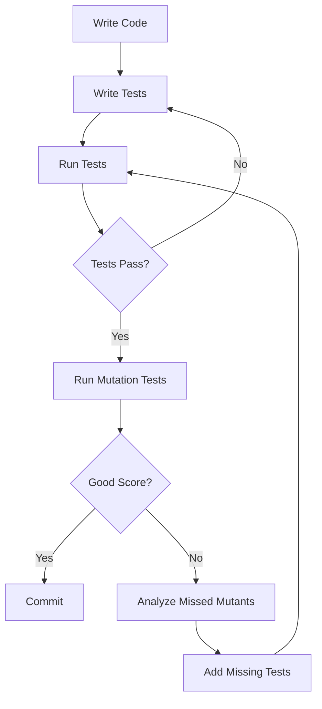

# Mutation Testing Guide

## Overview

Mutation testing is a technique to evaluate the quality of your tests by introducing small changes (mutations) to your code and checking if your tests catch them. If a test suite passes even with mutated code, it indicates weak test coverage.

This project uses [cargo-mutants](https://github.com/sourcefrog/cargo-mutants) for mutation testing.

## Concepts

### What is Mutation Testing?

1. **Mutation**: A small, deliberate change to source code
2. **Mutant**: A version of the code with a single mutation
3. **Caught**: A mutant that causes at least one test to fail (good!)
4. **Missed**: A mutant that passes all tests (indicates weak tests)
5. **Unviable**: A mutant that doesn't compile

### Example Mutations

```rust
// Original code
fn calculate_total(items: &[Item]) -> f64 {
    items.iter().map(|item| item.price).sum()
}

// Mutation 1: Change operator
fn calculate_total(items: &[Item]) -> f64 {
    items.iter().map(|item| item.price).product()  // sum() -> product()
}

// Mutation 2: Change return value
fn calculate_total(items: &[Item]) -> f64 {
    return 0.0;  // Always return 0
}

// Mutation 3: Remove iterator logic
fn calculate_total(items: &[Item]) -> f64 {
    0.0  // Remove entire calculation
}
```

**Good tests should catch all these mutations!**

## Installation

```bash
cargo install cargo-mutants
```

## Usage

### Quick Start

```bash
# Run mutation tests on schema module (fast)
./scripts/run-mutation-tests.sh quick

# List all mutation points
./scripts/run-mutation-tests.sh list

# Run full mutation testing
./scripts/run-mutation-tests.sh full
```

### Manual Commands

```bash
# Test a specific directory
cargo mutants --dir src/schema/

# Test a specific file
cargo mutants --file src/schema/query.rs

# List mutations without running tests
cargo mutants --list

# Show diffs of mutations
cargo mutants --in-diff

# Generate JSON report
cargo mutants --json --output report.json

# Run with custom timeout
cargo mutants --timeout 600

# Run in parallel
cargo mutants --jobs 4
```

### Script Modes

The `run-mutation-tests.sh` script provides several modes:

- `quick`: Test schema/ module only (5-10 minutes)
- `auth`: Test auth/ module only (5-10 minutes)
- `models`: Test models/ module only (5-10 minutes)
- `full`: Test entire codebase (30-60 minutes)
- `list`: List all mutation points without testing
- `diff`: Show diffs of mutations being tested
- `json`: Generate JSON report

## Configuration

Mutation testing is configured in `mutants.toml`:

```toml
# Excluded directories
exclude_dirs = ["target/", "tests/", "benches/"]

# Excluded files
exclude_files = ["src/main.rs", "build.rs"]

# Focus on critical modules
include_dirs = ["src/schema/", "src/auth/"]

# Timeout for each test run
timeout = 600

# Skip logging calls (unlikely to be caught)
skip_calls = ["tracing::info", "println"]
```

## Interpreting Results

### Mutation Score

**Mutation Score = (Caught / Total Viable Mutants) × 100%**

- **90-100%**: Excellent test quality
- **75-90%**: Good test quality
- **50-75%**: Adequate test quality
- **<50%**: Poor test quality, needs improvement

### Example Output

```
Mutation testing complete!
===========================
Total mutants: 245
Caught: 220 (89.8%)
Missed: 25 (10.2%)
Unviable: 15
Timeouts: 0

Mutation score: 89.8% ✓
```

### Viewing Results

After running mutation tests:

```bash
# HTML report (recommended)
open mutants.out/mutants.html

# Text report
cat mutants.out/mutants.txt

# Caught mutants
cat mutants.out/caught.txt

# Missed mutants (need better tests!)
cat mutants.out/missed.txt

# Unviable mutants
cat mutants.out/unviable.txt
```

## Improving Test Quality

### Analyzing Missed Mutants

When a mutant is missed, it means your tests don't cover that code path:

```rust
// Example: Missed mutant in validation
fn validate_email(email: &str) -> bool {
    email.contains('@') && email.len() > 5
    // If mutated to: email.contains('@') || email.len() > 5
    // And tests still pass, you need a test for:
    // - Email without @ but >5 chars
    // - Email with @ but <=5 chars
}
```

### Adding Tests for Missed Mutants

```rust
#[test]
fn test_validate_email_requires_both_conditions() {
    // Catches mutation: && -> ||
    assert!(!validate_email("test"));      // No @, <5 chars
    assert!(!validate_email("t@st"));      // Has @, but <=5 chars
    assert!(!validate_email("toolong"));   // No @, but >5 chars
    assert!(validate_email("test@example")); // Valid
}
```

## Best Practices

### 1. Run Mutation Tests Regularly

- **Locally**: Before submitting PRs
- **CI**: On nightly builds (too slow for every PR)
- **Focus**: Run quick mode on modified modules

### 2. Prioritize Critical Code

Test business logic modules first:
```bash
cargo mutants --dir src/schema/  # GraphQL resolvers
cargo mutants --dir src/auth/    # Authentication logic
cargo mutants --dir src/models/  # Data models
```

### 3. Set Realistic Goals

- Start with 75% mutation score
- Gradually improve to 85-90%
- 100% is rarely achievable (or necessary)

### 4. Skip Low-Value Mutations

Configure `mutants.toml` to skip:
- Logging/tracing calls
- Formatting functions
- Debug implementations

### 5. Understand Timeout Mutants

If mutants timeout:
- Infinite loops introduced by mutation
- Very slow tests
- Increase timeout in config

### 6. Use JSON Reports for Tracking

```bash
# Generate JSON report
cargo mutants --json --output mutants.json

# Track mutation score over time
# Compare mutants.json across commits
```

## Integration with CI/CD

Mutation testing is integrated into the nightly workflow:

```yaml
# .github/workflows/mutation-testing.yml
- name: Run mutation tests
  run: ./scripts/run-mutation-tests.sh quick
  timeout-minutes: 30
```

**Note**: Full mutation testing is too slow for PR checks (~60 min). Run in nightly builds instead.

## Common Issues

### Issue: Tests Timeout

**Cause**: Mutation creates infinite loop or very slow code

**Solution**: Increase timeout in `mutants.toml`:
```toml
timeout = 900  # 15 minutes
```

### Issue: Too Many Missed Mutants

**Cause**: Weak test coverage

**Solution**: Analyze `mutants.out/missed.txt` and add tests for uncovered scenarios

### Issue: Mutation Testing Takes Too Long

**Cause**: Testing entire codebase

**Solution**: Use modular approach:
```bash
# Test one module at a time
cargo mutants --dir src/schema/
cargo mutants --dir src/auth/
```

### Issue: False Positives (Caught but Shouldn't Be)

**Cause**: Over-specified tests (testing implementation details)

**Solution**: Focus tests on behavior, not implementation

## Examples

### Example 1: Testing a Simple Function

```rust
// Source: src/utils/math.rs
pub fn add(a: i32, b: i32) -> i32 {
    a + b
}

// Test (weak - missed mutants)
#[test]
fn test_add() {
    assert_eq!(add(2, 2), 4);
}

// This test misses mutations like:
// - a + b -> a - b
// - a + b -> a * b
// - a + b -> 0

// Better test (catches mutations)
#[test]
fn test_add_comprehensive() {
    assert_eq!(add(2, 3), 5);   // Catches a * b
    assert_eq!(add(5, -3), 2);  // Catches a - b
    assert_eq!(add(0, 0), 0);   // Catches return constant
    assert_eq!(add(-1, -1), -2); // Catches sign changes
}
```

### Example 2: Testing GraphQL Resolver

```rust
// Resolver
pub async fn get_user(ctx: &Context, id: Uuid) -> Result<User> {
    User::find_by_id(&ctx.db, id).await
}

// Test (catches mutations)
#[tokio::test]
async fn test_get_user() {
    let ctx = TestContext::new().await.unwrap();
    let user = ctx.user(TestUserRole::Employee);

    // Test success case
    let result = get_user(&ctx, user.id).await;
    assert!(result.is_ok());
    assert_eq!(result.unwrap().id, user.id);

    // Test not found case (catches: always return Ok)
    let invalid_id = Uuid::new_v4();
    let result = get_user(&ctx, invalid_id).await;
    assert!(result.is_err());
}
```

## Mutation Testing Workflow



## Further Reading

- [cargo-mutants GitHub](https://github.com/sourcefrog/cargo-mutants)
- [Mutation Testing Best Practices](https://mutationtesting.com/)
- [Effective Test Design](https://martinfowler.com/bliki/MutationTesting.html)

## Summary

- **Mutation testing validates test quality** by introducing code changes
- **Aim for 85-90% mutation score** for good test coverage
- **Run quick mode locally**, full mode in CI nightly
- **Analyze missed mutants** to improve tests
- **Focus on critical business logic** first
- **Configure `mutants.toml`** to skip low-value mutations
