# Data Model: Seed Data Implementation

**Feature**: Comprehensive Development Seed Data with Audit Logging
**Branch**: `038-seed-data-implementation`
**Date**: 2025-10-22

## Overview

This document defines the data model for the seed data system, including the seed execution context, configuration, and the relationships between seeded entities. The seed data system integrates with the existing SeaORM entity models and audit logging infrastructure.

## Seed Data System Entities

### SeedContext

**Purpose**: Tracks seed execution state and provides audit context for all seed operations.

**Attributes**:
- `system_user_id: Uuid` - ID of the system user used for audit logging attribution
- `batch_id: Uuid` - Unique identifier for this seed execution batch (groups all audit logs)
- `started_at: DateTime<Utc>` - Execution start timestamp
- `config: SeedConfig` - Configuration for this seed run

**Lifecycle**:
- Created at the start of seed execution
- Passed to all builder functions for audit logging
- Used to query audit logs for this specific seed run

**Relationships**:
- → `activity_logs.user_id` (as system user)
- → `activity_logs.batch_id` (groups all seed operations)

### SeedConfig

**Purpose**: Controls seed data volume, behavior, and entity selection.

**Attributes**:
- `volume_target: VolumeTarget` - Enum: Small (10-50), Medium (50-200), Large (200-1000)
- `clear_existing: bool` - Whether to truncate tables before seeding (default: false)
- `enable_audit_logging: bool` - Whether to create audit log entries (default: true)
- `seed_entities: HashSet<EntityType>` - Which entities to seed (default: all)
- `target_counts: HashMap<EntityType, usize>` - Specific counts per entity type

**Source**:
- Environment variables:
  - `SEED_VOLUME_TARGET` → `volume_target`
  - `SEED_CLEAR_EXISTING` → `clear_existing`
  - `SEED_ENABLE_AUDIT` → `enable_audit_logging`
  - `SEED_USER_COUNT`, `SEED_DEPARTMENT_COUNT`, etc. → `target_counts`

**Defaults** (for Small volume target):
```rust
SeedConfig {
    volume_target: VolumeTarget::Small,
    clear_existing: false,
    enable_audit_logging: true,
    seed_entities: EntityType::all(),  // All entity types
    target_counts: hashmap! {
        EntityType::Roles => 4,          // Fixed set
        EntityType::Permissions => 30,    // Core permission set
        EntityType::Departments => 10,
        EntityType::Users => 50,
        EntityType::LeaveTypes => 5,
        EntityType::LeaveRequests => 30,
        EntityType::Events => 20,
        EntityType::Documents => 25,
        EntityType::ReviewCycles => 3,
        EntityType::PerformanceReviews => 15,
        EntityType::Tasks => 40,
        EntityType::TimeEntries => 100,
    }
}
```

### SeedResult

**Purpose**: Tracks seed execution results for reporting.

**Attributes**:
- `entity_results: Vec<EntitySeedResult>` - Per-entity seeding results
- `total_created: usize` - Total records created
- `total_skipped: usize` - Total records skipped (already existed)
- `total_failed: usize` - Total records that failed to create
- `execution_time: Duration` - Total execution time
- `batch_id: Uuid` - Reference to audit log batch_id

**EntitySeedResult**:
- `entity_type: EntityType` - Which entity was seeded
- `created_count: usize` - Number created
- `skipped_count: usize` - Number skipped (existed)
- `failed_count: usize` - Number failed
- `errors: Vec<String>` - Error messages if any

## Existing Database Entity Relationships

This section maps the relationships between existing SeaORM entities that will be populated by seed data.

### Foundation Layer (No Dependencies)

#### Role
**Table**: `hr_public.roles`
**Attributes**:
- `id: Uuid` (PK)
- `name: String` (UNIQUE) - "Admin", "HR Manager", "Manager", "Employee"
- `description: String`
- `level: i32` - Hierarchy level (100, 75, 50, 25)

**Relationships**:
- One Role → Many RolePermission
- One Role → Many UserRoleAssignment

**Seed Strategy**: Create 4 fixed roles (already defined in spec)

#### Permission
**Table**: `hr_public.permissions`
**Attributes**:
- `id: Uuid` (PK)
- `resource: String` - Resource name (users, departments, etc.)
- `action: String` - Action name (read, write, delete, etc.)
- `description: String`
- **UNIQUE**: (resource, action)

**Relationships**:
- One Permission → Many RolePermission

**Seed Strategy**: Create ~30 core permissions covering all resources

#### LeaveType
**Table**: `hr_public.leave_types`
**Attributes**:
- `id: Uuid` (PK)
- `name: String` (UNIQUE) - "Annual", "Sick", "Parental", etc.
- `description: String`
- `default_days: i32`
- `requires_approval: bool`
- `is_paid: bool`

**Relationships**:
- One LeaveType → Many LeaveBalance
- One LeaveType → Many LeaveRequest

**Seed Strategy**: Create 5-7 common leave types

### Core Layer (Foundation Dependencies)

#### Department
**Table**: `hr_public.departments`
**Attributes**:
- `id: Uuid` (PK)
- `name: String` (UNIQUE)
- `description: String`
- `parent_id: Option<Uuid>` (FK → departments) - Self-referential hierarchy
- `manager_id: Option<Uuid>` (FK → users) - Circular dependency

**Relationships**:
- One Department → Many User (employees in department)
- One Department → One User (manager) - **Circular dependency with User**
- One Department → Many Department (children)

**Seed Strategy**:
1. Create departments without manager_id first
2. After users are created, update departments with manager_id

**Example Hierarchy**:
```
- Engineering (parent=null, manager=TBD)
  - Frontend (parent=Engineering, manager=TBD)
  - Backend (parent=Engineering, manager=TBD)
- Human Resources (parent=null, manager=TBD)
- Sales (parent=null, manager=TBD)
```

#### User
**Table**: `hr_public.users`
**Attributes**:
- `id: Uuid` (PK)
- `email: String` (UNIQUE)
- `password_hash: String` - Bcrypt hash (use "password123" for all test users)
- `first_name: String`
- `last_name: String`
- `role: String` - Legacy field (deprecated, use user_role_assignments)
- `is_active: bool`
- `hire_date: DateTime<Utc>`
- `department_id: Option<Uuid>` (FK → departments)
- `manager_id: Option<Uuid>` (FK → users) - Self-referential
- `phone: Option<String>`
- `profile_picture_url: Option<String>`
- `theme_preference: Option<String>` - UI theme setting

**Relationships**:
- One User → Many UserRoleAssignment
- One User → Many LeaveBalance
- One User → Many LeaveRequest
- One User → Many Event (as creator)
- One User → Many EventAttendee
- One User → Many Document (as uploader)
- One User → Many PerformanceReview (as reviewee)
- One User → Many Task (as creator/assignee)
- One User → Many TimeEntry
- One User → Many ActivityLog (as actor)
- One User → One Department (employee's department)
- One User → One User (manager) - Self-referential

**Seed Strategy**:
1. Generate 10-50 users with realistic names (fake-rs library)
2. Assign to departments
3. Assign manager relationships (hierarchical)
4. Password: `$2b$12$2gLwMJCF1vg/WnFrDPgB0eT663zBtCQw.iiOq15NLSuWWrUqkfH9e` (hash for "password123")

#### RolePermission (Join Table)
**Table**: `hr_public.role_permissions`
**Attributes**:
- `id: Uuid` (PK)
- `role_id: Uuid` (FK → roles)
- `permission_id: Uuid` (FK → permissions)

**Seed Strategy**: Assign permissions based on role hierarchy:
- Admin: All permissions
- HR Manager: HR-related permissions
- Manager: Team management permissions
- Employee: Basic read permissions

#### UserRoleAssignment (Join Table)
**Table**: `hr_public.user_role_assignments`
**Attributes**:
- `id: Uuid` (PK)
- `user_id: Uuid` (FK → users)
- `role_id: Uuid` (FK → roles)

**Seed Strategy**: Assign at least one role per user, distribute realistically:
- 10% Admin
- 15% HR Manager
- 25% Manager
- 50% Employee

### Extended Layer (Core Dependencies)

#### LeaveBalance
**Table**: `hr_public.leave_balances`
**Attributes**:
- `id: Uuid` (PK)
- `user_id: Uuid` (FK → users)
- `leave_type_id: Uuid` (FK → leave_types)
- `year: i32`
- `total_days: Decimal`
- `used_days: Decimal`
- `remaining_days: Decimal`

**Relationships**:
- One LeaveBalance → One User
- One LeaveBalance → One LeaveType

**Seed Strategy**: Create balance record for each user + leave type combination for current year

#### EmployeeSkill
**Table**: `hr_public.employee_skills`
**Attributes**:
- `id: Uuid` (PK)
- `user_id: Uuid` (FK → users)
- `skill_name: String`
- `proficiency_level: ProficiencyLevel` - Enum: Beginner, Intermediate, Advanced, Expert
- `years_experience: Option<i32>`
- `last_used_date: Option<DateTime<Utc>>`

**Seed Strategy**: Add 2-5 skills per employee from tech/business skill pool

#### EmployeeCertification
**Table**: `hr_public.employee_certifications`
**Attributes**:
- `id: Uuid` (PK)
- `user_id: Uuid` (FK → users)
- `certification_name: String`
- `issuing_organization: String`
- `issue_date: DateTime<Utc>`
- `expiry_date: Option<DateTime<Utc>>`
- `credential_id: Option<String>`

**Seed Strategy**: Add 0-2 certifications per employee

#### EmergencyContact
**Table**: `hr_public.emergency_contacts`
**Attributes**:
- `id: Uuid` (PK)
- `user_id: Uuid` (FK → users)
- `name: String`
- `relationship: String`
- `phone: String`
- `alternate_phone: Option<String>`
- `email: Option<String>`
- `is_primary: bool`

**Seed Strategy**: Add 1-2 emergency contacts per employee

#### UserAddress
**Table**: `hr_public.user_addresses`
**Attributes**:
- `id: Uuid` (PK)
- `user_id: Uuid` (FK → users)
- `address_type: String` - "home", "work", "billing"
- `street_line_1: String`
- `street_line_2: Option<String>`
- `city: String`
- `state_province: String`
- `postal_code: String`
- `country: String`
- `is_primary: bool`

**Seed Strategy**: Add 1 primary home address per employee

### Operational Layer (Multiple Dependencies)

#### LeaveRequest
**Table**: `hr_public.leave_requests`
**Attributes**:
- `id: Uuid` (PK)
- `user_id: Uuid` (FK → users)
- `leave_type_id: Uuid` (FK → leave_types)
- `start_date: DateTime<Utc>`
- `end_date: DateTime<Utc>`
- `days_requested: Decimal`
- `status: RequestStatus` - Enum: Pending, Approved, Denied, Cancelled
- `reason: Option<String>`
- `reviewer_id: Option<Uuid>` (FK → users)
- `reviewed_at: Option<DateTime<Utc>>`
- `reviewer_notes: Option<String>`

**Seed Strategy**: Create 30-50 requests across users with mixed statuses:
- 40% Approved
- 30% Pending
- 20% Denied
- 10% Cancelled

#### Event
**Table**: `hr_public.events`
**Attributes**:
- `id: Uuid` (PK)
- `title: String`
- `description: Option<String>`
- `start_time: DateTime<Utc>`
- `end_time: DateTime<Utc>`
- `all_day: bool`
- `location: Option<String>`
- `creator_id: Uuid` (FK → users)
- `event_type: String` - "meeting", "company_event", "training", etc.
- `is_recurring: bool`
- `recurrence_rule: Option<String>` - RRULE format
- `max_attendees: Option<i32>`
- `is_public: bool`

**Relationships**:
- One Event → Many EventAttendee
- One Event → One User (creator)

**Seed Strategy**: Create 20-30 events (mix of past, current, future):
- 50% Meetings
- 30% Company events
- 20% Training sessions
- Include 2-3 recurring events

#### EventAttendee
**Table**: `hr_public.event_attendees`
**Attributes**:
- `id: Uuid` (PK)
- `event_id: Uuid` (FK → events)
- `user_id: Uuid` (FK → users)
- `rsvp_status: RsvpStatus` - Enum: Invited, Accepted, Declined, Maybe, Waitlist
- `is_organizer: bool`
- `attendance_status: Option<AttendanceStatus>` - Enum: Present, Absent, Late

**Seed Strategy**: Add 3-10 attendees per event with mixed RSVP statuses

#### Document
**Table**: `hr_public.documents`
**Attributes**:
- `id: Uuid` (PK)
- `title: String`
- `file_name: String`
- `file_path: String` - Logical path (no actual file created)
- `file_size: i64`
- `mime_type: String`
- `uploaded_by: Uuid` (FK → users)
- `uploaded_at: DateTime<Utc>`
- `document_type: String` - "policy", "handbook", "form", "certificate"
- `is_public: bool`
- `expiry_date: Option<DateTime<Utc>>`
- `version: i32`

**Seed Strategy**: Create 25-40 document metadata records (no actual files):
- 40% Policy documents
- 30% Forms
- 20% Certificates
- 10% Handbooks

#### ReviewCycle
**Table**: `hr_public.review_cycles`
**Attributes**:
- `id: Uuid` (PK)
- `name: String` - "Q1 2025", "Annual 2024", etc.
- `start_date: DateTime<Utc>`
- `end_date: DateTime<Utc>`
- `status: CycleStatus` - Enum: Planning, Active, Completed
- `description: Option<String>`

**Seed Strategy**: Create 2-3 review cycles (past, current, future)

#### PerformanceReview
**Table**: `hr_public.performance_reviews`
**Attributes**:
- `id: Uuid` (PK)
- `employee_id: Uuid` (FK → users)
- `reviewer_id: Uuid` (FK → users)
- `review_cycle_id: Uuid` (FK → review_cycles)
- `status: ReviewStatus` - Enum: Draft, Submitted, Completed
- `overall_rating: Option<i32>` - 1-5 scale
- `review_date: DateTime<Utc>`
- `strengths: Option<String>`
- `areas_for_improvement: Option<String>`
- `goals_met: Option<bool>`

**Seed Strategy**: Create 15-30 reviews across employees and cycles

#### Task
**Table**: `hr_public.tasks`
**Attributes**:
- `id: Uuid` (PK)
- `title: String`
- `description: Option<String>`
- `status: TaskStatus` - Enum: Todo, InProgress, Review, Done, Cancelled
- `priority: TaskPriority` - Enum: Low, Medium, High, Urgent
- `creator_id: Uuid` (FK → users)
- `due_date: Option<DateTime<Utc>>`
- `completed_at: Option<DateTime<Utc>>`
- `project: Option<String>`
- `tags: Option<Vec<String>>`

**Relationships**:
- One Task → Many TaskAssignee
- One Task → One User (creator)

**Seed Strategy**: Create 40-60 tasks with mixed statuses:
- 30% Todo
- 25% InProgress
- 20% Done
- 15% Review
- 10% Cancelled

#### TaskAssignee
**Table**: `hr_public.task_assignees`
**Attributes**:
- `id: Uuid` (PK)
- `task_id: Uuid` (FK → tasks)
- `user_id: Uuid` (FK → users)
- `assigned_at: DateTime<Utc>`

**Seed Strategy**: Assign 1-3 users per task

#### TimeEntry
**Table**: `hr_public.time_entries`
**Attributes**:
- `id: Uuid` (PK)
- `user_id: Uuid` (FK → users)
- `start_time: DateTime<Utc>`
- `end_time: Option<DateTime<Utc>>`
- `duration_minutes: Option<i32>`
- `task_id: Option<Uuid>` (FK → tasks)
- `project: Option<String>`
- `description: Option<String>`
- `billable: bool`

**Seed Strategy**: Create 100-150 time entries across users for past 2 weeks

### Audit Layer (Auto-Generated)

#### ActivityLog
**Table**: `hr_public.activity_logs`
**Attributes**:
- `id: Uuid` (PK)
- `user_id: Uuid` (FK → users) - System user for seed operations
- `employee_id: Option<Uuid>`
- `action: String` - "CREATE" for all seed operations
- `resource_type: String` - Entity type name
- `resource_id: Option<Uuid>` - Created entity ID
- `details: Option<JsonValue>` - {"source": "seed_data", "batch_id": "<uuid>"}
- `before_snapshot: Option<JsonValue>` - Null for CREATE
- `after_snapshot: Option<JsonValue>` - Optional full entity snapshot
- `is_rollback: bool` - false
- `batch_id: Option<Uuid>` - Seed batch ID for grouping
- `ip_address: Option<String>` - "127.0.0.1"
- `user_agent: Option<String>` - "seed-data-binary"
- `created_at: DateTime<Utc>`

**Seed Strategy**: Auto-created via audit helper for every entity insertion

## Entity Dependency Graph

```mermaid
graph TD
    %% Foundation (no dependencies)
    Role[Role]
    Permission[Permission]
    LeaveType[LeaveType]

    %% Foundation relationships
    RolePermission[RolePermission]
    Role --> RolePermission
    Permission --> RolePermission

    %% Core
    Department[Department]
    User[User]

    %% Core relationships
    Department -.circular.-> User
    User --> Department
    User -.self-ref.-> User

    UserRoleAssignment[UserRoleAssignment]
    User --> UserRoleAssignment
    Role --> UserRoleAssignment

    %% Extended
    LeaveBalance[LeaveBalance]
    User --> LeaveBalance
    LeaveType --> LeaveBalance

    EmployeeSkill[EmployeeSkill]
    User --> EmployeeSkill

    EmployeeCertification[EmployeeCertification]
    User --> EmployeeCertification

    EmergencyContact[EmergencyContact]
    User --> EmergencyContact

    UserAddress[UserAddress]
    User --> UserAddress

    %% Operational
    LeaveRequest[LeaveRequest]
    User --> LeaveRequest
    LeaveType --> LeaveRequest

    Event[Event]
    User --> Event

    EventAttendee[EventAttendee]
    Event --> EventAttendee
    User --> EventAttendee

    Document[Document]
    User --> Document

    ReviewCycle[ReviewCycle]

    PerformanceReview[PerformanceReview]
    User --> PerformanceReview
    ReviewCycle --> PerformanceReview

    Task[Task]
    User --> Task

    TaskAssignee[TaskAssignee]
    Task --> TaskAssignee
    User --> TaskAssignee

    TimeEntry[TimeEntry]
    User --> TimeEntry
    Task --> TimeEntry

    %% Audit (auto-generated)
    ActivityLog[ActivityLog]
    User --> ActivityLog
```



## Seeding Execution Order

Based on dependency analysis:

1. **Phase 0: System Setup**
   - Create or verify system user exists
   - Initialize SeedContext with batch_id

2. **Phase 1: Foundation**
   - Roles (4 records)
   - Permissions (~30 records)
   - RolePermissions (role-permission mappings)
   - LeaveTypes (5-7 records)

3. **Phase 2: Core Entities**
   - Departments (10 records, without manager_id)
   - Users (10-50 records, with department_id)
   - Update Departments with manager_id (circular dependency resolution)
   - UserRoleAssignments

4. **Phase 3: Extended Entities**
   - LeaveBalances (user × leave_type combinations)
   - EmployeeSkills (2-5 per user)
   - EmployeeCertifications (0-2 per user)
   - EmergencyContacts (1-2 per user)
   - UserAddresses (1 per user)

5. **Phase 4: Operational Entities**
   - LeaveRequests (30-50 records)
   - ReviewCycles (2-3 records)
   - PerformanceReviews (15-30 records)
   - Events (20-30 records)
   - EventAttendees (3-10 per event)
   - Documents (25-40 records)
   - Tasks (40-60 records)
   - TaskAssignees (1-3 per task)
   - TimeEntries (100-150 records)

6. **Phase 5: Audit Trail**
   - ActivityLogs (auto-created during phases 1-4)
   - Final summary log entry

## Data Integrity Constraints

### Uniqueness Constraints

| Entity | Unique Fields | Idempotency Strategy |
|--------|--------------|---------------------|
| Role | name | Check by name before insert |
| Permission | (resource, action) | Check by resource+action before insert |
| Department | name | Check by name before insert |
| User | email | Generate email with counter (user1@, user2@, ...) |
| LeaveType | name | Check by name before insert |

### Foreign Key Constraints

All foreign key relationships must be satisfied at insert time:
- **User → Department**: Department must exist before user creation
- **User → User (manager)**: Manager user must exist before assignment
- **Department → User (manager)**: User must exist before department manager update
- **LeaveRequest → User, LeaveType**: Both must exist
- **Event → User (creator)**: Creator must exist
- **All other relationships**: Parent entities must exist before child creation

### Circular Dependency Resolution

**Department ↔ User (manager_id)**:
1. Create departments with `manager_id = NULL`
2. Create users with `department_id` referencing existing departments
3. Update departments, setting `manager_id` to existing users

## Volume Targets by Entity

Based on FR-014 (10-50 records per entity type):

| Entity | Target Count | Rationale |
|--------|-------------|-----------|
| Roles | 4 | Fixed set (Admin, HR Manager, Manager, Employee) |
| Permissions | 30 | Core permission set |
| RolePermissions | ~60 | Mappings based on role hierarchy |
| Departments | 10 | Small org structure |
| Users | 50 | Upper bound for pagination testing |
| UserRoleAssignments | 50 | One role per user minimum |
| LeaveTypes | 5 | Common leave types |
| LeaveBalances | 250 | 50 users × 5 leave types |
| LeaveRequests | 35 | Subset of users with requests |
| EmployeeSkills | 150 | 3 skills per user average |
| EmployeeCertifications | 25 | Sparse - not all employees |
| EmergencyContacts | 75 | 1.5 contacts per user average |
| UserAddresses | 50 | 1 address per user |
| Events | 25 | Mix of meeting types |
| EventAttendees | 150 | 6 attendees per event average |
| Documents | 30 | Policy and form documents |
| ReviewCycles | 3 | Quarterly/annual cycles |
| PerformanceReviews | 20 | Subset of employees reviewed |
| Tasks | 50 | Active and completed tasks |
| TaskAssignees | 75 | 1.5 assignees per task |
| TimeEntries | 125 | 2-3 entries per user over 2 weeks |
| ActivityLogs | ~1100 | One log per entity created |

**Total Records**: ~2,300 across all tables

**Estimated Execution Time**: 15-25 seconds (based on 100-150 inserts/second with audit logging)

## Validation Rules

### Data Quality Rules

1. **User Email Format**: `user{N}@mountainhr.dev` (N = 1 to target_count)
2. **User Password**: All users use same bcrypt hash for "password123"
3. **Timestamps**: Vary created_at/hire_date over past 1-2 years for history simulation
4. **Realistic Names**: Use fake-rs library for first/last names
5. **Phone Numbers**: Use fake-rs library with consistent format
6. **Addresses**: Use fake-rs library for realistic addresses

### Relationship Validation

1. **Manager Hierarchy**: No circular references (user cannot be own manager)
2. **Department Hierarchy**: No circular parent references
3. **Role Levels**: Admin (100) > HR Manager (75) > Manager (50) > Employee (25)
4. **Leave Balance**: `remaining_days = total_days - used_days`
5. **Event Times**: `end_time > start_time`
6. **Date Ranges**: `end_date >= start_date` for leave requests, review cycles, etc.

### Audit Log Validation

1. **Every Seed Operation**: One activity_log entry per created entity
2. **Batch ID Consistency**: All logs use same batch_id from SeedContext
3. **System User**: All logs use system user ID as actor
4. **Action Type**: All seed logs have action = "CREATE"
5. **Resource Type**: Matches entity table name
6. **Source Tag**: `details.source = "seed_data"`

## Error Handling

### Idempotency Errors

- **Duplicate Key Violation**: Skip and log as "already exists"
- **Constraint Violation**: Skip and log as "constraint failed"

### Foreign Key Errors

- **Missing Parent Entity**: Log error and skip child creation
- **Invalid Reference**: Log error and skip

### Partial Failure Strategy

Per FR-012 (continue on failure):
- Log error details to console and SeedResult
- Continue with next entity
- Mark entity as "failed" in SeedResult
- Do NOT rollback transaction
- Rely on idempotent re-run to complete missing data

## Schema Compatibility

### SeaORM Version

- **Target**: SeaORM 0.12.x (as specified in Cargo.toml)
- **Features**: sqlx-postgres, runtime-tokio-rustls, macros, with-uuid, with-chrono

### Migration Compatibility

- **Seed Data Runs**: After all migrations complete
- **Migration Check**: Optional - verify latest migration applied before seeding
- **Schema Version**: Compatible with migration m20251020_005 (latest)

## Security Considerations

### Password Hashing

- **Algorithm**: bcrypt with cost factor 12
- **Test Password**: "password123" (DO NOT use in production)
- **Hash**: `$2b$12$2gLwMJCF1vg/WnFrDPgB0eT663zBtCQw.iiOq15NLSuWWrUqkfH9e`

### Environment Checks

- **ENABLE_SEED_DATA**: Must be "true" to run
- **OR ENVIRONMENT**: Must be "development" to run
- **Production Guard**: Fail with clear error if neither condition met

### Audit Trail

- **System User**: Dedicated system user for seed operations
- **IP Address**: "127.0.0.1" (localhost) for all seed logs
- **User Agent**: "seed-data-binary" for identification
- **Batch ID**: Groups all seed operations for this run

## Summary

This data model defines a comprehensive seed data system that:
- Creates 2,300+ records across 25+ entity types
- Respects all foreign key constraints via dependency ordering
- Integrates with existing activity_log audit system
- Executes in <30 seconds per FR-014 and SC-004
- Provides idempotent execution via skip-existing strategy
- Generates realistic test data for all HR application features
